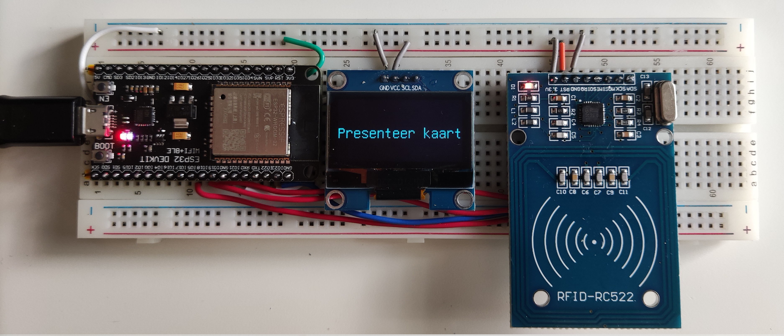
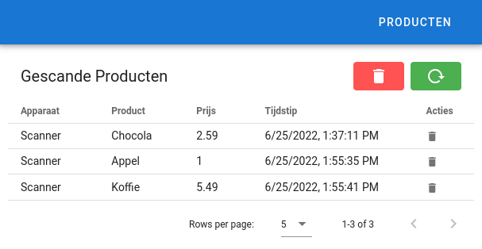

# Athom Challenge: ES32 product scanner
Deze repository bevat de software voor een productscanner gebaseerd op de ESP32. De ESP32 scant een mifare-tag. De unieke ID van de mifare-tag wordt naar de backend gestuurd. Als deze tag bekend is bij de backend zal de productnaam en -prijs teruggestuurd worden in json-format. De ESP32 zet deze gegevens vervolgens op het aangesloten OLED-scherm. De frontend kan gebruikt worden om te zien welke tags zijn gescand, en om de productnamen/-prijzen aan te passen.

## Over de applicatie
### ESP32
De firmware voor de ESP32 is geschreven met behulp van `esp-idf` en een tweetal bibliotheken voor de aansturing van het [OLED-scherm](https://github.com/olikraus/u8g2.git) en de [taglezer](https://github.com/abobija/esp-idf-rc522.git).

### Backend
De backend maakt gebruik van `express` voor de HTTP-requests, `mongoose` voor de communicatie met MongoDB. De backend is geschreven in Typescript.

### Frontend
De frontend is gemaakt met `Vue` en `Vuetify`. `fetch` wordt gebruikt om data op te halen van de backend. 

## Starten van de applicatie
1. Installeer `node`, `npm` en `esp-idf`. Voor de backend moet `MongoDB` geinstalleerd worden.
2. Flash de firmware op de ESP32:
    - `cd scanner_firmware`
    - Configureer de firmware: `idf.py menuconfig` Ga naar het tabblad `APPLICATION SETTINGS` en vul de juiste waardes in
    - Build de firmware: `idf.py build`
    - Flash de firmware: `idf.py flash`
3. Installeer en start de backend:
    - `cd ../backend`
    - `npm install`
    - `npm run start`
    - Instellingen kunnen worden aangepast in het `.env` bestand
4. Installeer en start de frontend:
    - `cd ../frontend`
    - `npm install`
    - `npm run serve`